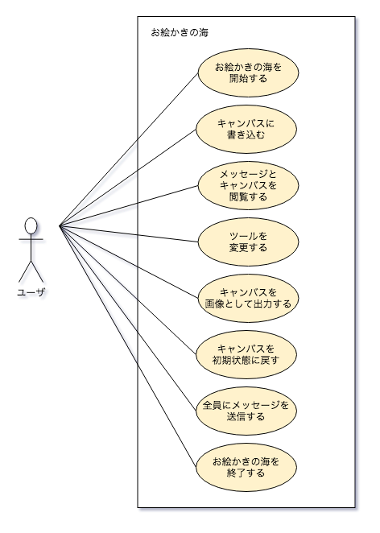

## ユースケース図

## ユースケース記述
|  ユースケース名 |  アクター  |事前条件|  基本系列  |事後条件|説明|
| :- | :- | :- | :- | :- | :- |
|お絵かきチャットを開始する|ユーザ|1. Webブラウザが起動されている.|1. アクターが, トップページのURLにアクセスする. 2. システムが, トップページを表示する. 3. アクターが, 「Name」フィールドにハンドルネームを入力する. 4. システムが, メインページを表示する.|1. メインページが表示されている.|トップページ<ul><li>本アプリケーションのタイトルを表示する.</li> <li>ユーザ自身のハンドルネームを入力するための「Name」フィールドを表示する.</li><li>チャットを開始するための「Start」ボタンを表示する.</li></ul>メインページ<ul><li>アプリケーションのタイトルを表示する.</li><li>ユーザ全体のメッセージを送信順に表示する.</li><li>ユーザ自身のハンドルネームを表示する.</li><li>送信するメッセージを入力するための「Message」フィールドを表示する.</li><li>メッセージを送信するための「Send」ボタンを表示する.</li><li>絵を描くためのキャンバスを表示する.</li><li>絵を描く為のツールを変更するための「Tools」ボタンを表示する.</li><li>キャンバスを初期状態に戻す「Clear」ボタンを表示する.</li><li>キャンバスを画像出力する為の「OutputImg」ボタンを表示する.</li><li>お絵かきチャットを終了するための「End」ボタンを表示する.</li></ul>|
|  全員のメッセージを送信する  | ユーザ  | 1. メインページが表示されている.| 1. アクターが, 「Message」フィールドに送信するメッセージを入力する.  2. アクターが,「Send」ボタンを押下する.  3. システムが,　送信されたメッセージをアクターからの発言として記録する.|1. アクターからの発言が記録されている.  2. メインページが表示されている.||
|全員のメッセージを閲覧する|ユーザ|1. メインページが表示されている|1. システムが, メインページに表示されている発言を更新する.|1. メインページが表示されている|発言<ul><li>ハンドルネームとメッセージからなる組</li></ul>|
|キャンバスに描き込む|ユーザー|1. メインページが表示されている.|1. アクターが, キャンバス上でマウスを左クリックする. 2. システムが, キャンバスに加えられた変更を記録する.|1. メインページが表示されている.|キャンバス上でマウスを左クリックして起こる動作はお絵かきツールによって異なる.|
|  キャンバスを閲覧する  |  ユーザ  |1. メインページが表示されている. | 1. システムが, キャンパスの更新内容をユーザに送信する. |1. メインページが表示されている.||
|お絵かきツールを変更する|ユーザ|1. メインページが表示されている.|1. アクターが, 「Tools」ボタンを押下する. 2. システムが, 対応するツールを記録する.|1. メインページが表示されている.|「Tools」の種類<ul><li>筆の色, 筆の大きさ, 消しゴム, スポイト</li></ul>|
|キャンバスを画像として出力する|ユーザー|1. メインページが表示されている.|1. アクターが, 「OutputImg」ボタンを押下する. 2. アクターが, 出力される画像の名前を指定する. 3. アクターが, 画像の出力先を指定する. 4. システムが, キャンバスを画像で指定された場所に出力する.|1. メインページが表示されている.||
|キャンバスのレイヤーを変更する|ユーザ|1. メインページが表示されている.|1. アクターが，レイヤーを切り替える. 2. システムが, レイヤーを切り替える．|1. メインページが表示されている.|レイヤー<ul><li>複数の画像を重ねる機能</li></ul>|
|キャンバスを初期状態に戻す|ユーザ|1. メインページが表示されている.|1. アクターが, 「Clear」ボタンを押下する.  2. システムが, キャンバスのデータを削除する.|1. メインページが表示されている.||
|お絵かきチャットを終了する|ユーザー|1. メインページが表示されている.|1. アクターが, 「End」ボタンを押下する. 2. システムが, トップページを表示する.|1. トップページが表示されている.||
